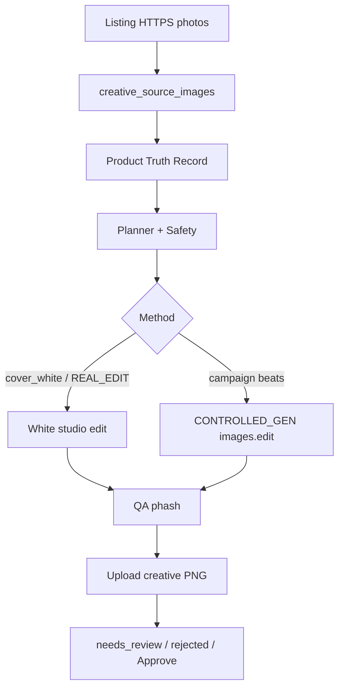

# Creative pipeline audit — flood light → lawn mower

**Date:** 2026-07-14  
**Pipeline at audit:** `creative-identity-v12`  
**Scope:** Read-only inspection of source selection → generation → QA → cache/isolation.  
**User report:** Commercial Electric Flood Light upload produced lawn-mower cinematic creatives; soft Approve still offered after drift warnings.

---

## Executive finding

**Most likely cause:** Professional+ slots ran **CONTROLLED_GENERATION** (OpenAI `images.edit` with 1–3 reference photos) driven by **outdoor_lighting / lifestyle art-direction prompts**. The model kept a “yard / outdoor” vibe and **substituted a stereotypical outdoor tool (lawn mower)** despite reference photos and textual identity locks.

**Not the primary cause:** Pure text-to-image (`images.generate`) — the code path always requires a source buffer and calls **`images.edit`**.

**Also plausible contributors:**

1. Soft QA bands that can surface wrong-object outputs as `needs_review` with Approve before hard reject (partially tightened in v12, still not enough for category substitution).
2. **`product_id` null** source/truth pools mixing a user’s orphaned images across packs.
3. Job cache reuse scoped by pack + source sha (safe if IDs are correct; unsafe if pack/`product_id` is wrong).
4. Ban-prompts that literally name “lawn mower” (can prime the model).

**Philosophy reset for Phase 2+:** Higlou = **AI product photography studio** (presentation only). Not an AI art / category reinventor.

---

## Current flow (as implemented)

1. Sync listing photos → `creative_source_images` (`lib/creative/intake.ts`) — **originals only**.
2. Build Truth → `product_truth_records`.
3. Plan: conversion story + Safety pick `method` + `sourceImageId` (`planner.ts`, `safety.ts`, `studio-safety.ts`).
4. `runStudioPack` → optional Product Identity gate → `executeSlotJob`.
5. Fetch **`source.originalUrl`** buffer → `runCreativeMethod`.
6. White cover → REAL_EDIT; Professional+ campaign → CONTROLLED_GEN / COMPOSITE.
7. QA → store creative URL (originals never overwritten).

---

## Audit checklist (12 points)

### 1. Where source image is selected

| Location | Role |
|---|---|
| `lib/creative/studio-safety.ts` — `pickBest`, `pickHeroSource`, `selectSourceForStudioSlot` | Role + quality + `originalUrl` |
| `lib/creative/safety.ts` — `resolveSourceForRecipe`, `decideSlotSafety` | Sets `sourceImageId` |
| `lib/creative/planner.ts` | Copies source onto planned slots |
| `lib/creative/studio-service.ts` — `loadSourcesForPack` | Loads by `user_id` + `product_id` (or **all null-product rows**) |

### 2. Is source passed to the generation API?

**Yes.** Photo methods throw without `sourceBuffer`. OpenAI path uses `openai.images.edit({ image: file | files[] })` in:

- `lib/creative/providers/openai-edit.ts`
- `lib/creative/providers/controlled-gen.ts`

No creative provider calls `images.generate` (pure text-to-image).

### 3. Image editing vs pure text generation

| Path | Behavior | Invent risk |
|---|---|---|
| REAL_EDIT | remove.bg / local white studio / OpenAI edit with preserve prompt | Low |
| CONTROLLED_GENERATION | OpenAI edit + campaign / DNA / category environment prompts | **High** |
| COMPOSITE | Prefer OpenAI controlled-gen; else local cutout + scene | Medium–high (OpenAI route) |

### 4. Where category becomes the generation subject

- `config/conversion-stories.ts` — `detectCategoryFamily("flood light")` → `outdoor_lighting`
- `config/campaign-art-direction.ts` — outdoor patio / yard lighting environment injected into prompts
- `lib/creative/providers/controlled-gen.ts` — category + beat briefs prepended to every CONTROLLED_GEN call

Category correctly classifies flood lights, then **over-steers scene language** toward outdoor lifestyle — where substitution happens.

### 5. Where product identity is lost

Despite Product Identity lock (`lib/creative/product-identity.ts`) and prompt blocks:

- Lifestyle / campaign prompts invite full scene freestyle.
- Identity locks are **text-only**; no hard visual class gate before showing the user.
- Product can be framed small (lifestyle occupancy ~35%) → easier for models to invent another object.

### 6. Prompts encouraging reconstruction

- REAL_EDIT (`openai-edit.ts`): strong preserve — good Phase 2 base.
- CONTROLLED_GEN / DNA / art-direction: “environment may change,” Nike/Apple lifestyle energy — models often misread as license to resynthesize the product.
- Recipe tokens like `PRESERVE_PRODUCT` are metadata; not always injected verbatim into the API prompt.

### 7. Previous AI images reused as sole reference?

**By design, no.** Jobs fetch listing `originalUrl`. Truth marks `generatedImagesAreNotEvidence: true`. Creatives upload under `…/creative/{packId}/…`, not as source rows — unless a user re-uploads an AI PNG as a listing photo.

### 8. Hardcoded category examples

- `creative-recipes.ts`: methods/roles only — no lawn scenes.
- `campaign-art-direction.ts` / `conversion-stories.ts` / `creative-dna.ts`: outdoor / dusk / **literal “lawn mower” ban** language.
- eBay category regex mentions lawn mower (`config/ebay-categories.ts`) — unrelated to Creative Studio image gen.

### 9. Cached data from previous products

| Cache | Cross-product risk |
|---|---|
| Pack fingerprint (`pack-fingerprint.ts`) | Audit/metrics; not in job key |
| Job idempotency `gen:{packId}:{slot}:{source.sha256}:{method}:{pipeline}:rN` | Same pack + same source hash → reuse; should not cross listings if pack/product wiring is correct |
| Analysis cache (`analysis-cache.ts`) | Can bias Truth/type if fingerprint collisions; not direct pixel swap |

### 10. Listing / image ID mixing

| Risk | Severity |
|---|---|
| `product_id` **null** bucket for sources/truth | **High** — one user’s orphaned images share a pool |
| Pack ignores pinned `truth_record_id` (loads latest) | Medium |
| Stale `sourceImageId` after re-sync | Low–medium |

### 11. Could lawn mower be stale DB / wrong listing / cache / shared state?

| Hypothesis | Verdict |
|---|---|
| CONTROLLED_GEN invents outdoor tool from lifestyle prompts | **Most likely** |
| Wrong / null `product_id` feeding wrong photo | Possible secondary |
| Job cache from another product | Unlikely unless same pack + same sha |
| In-memory shared buffers across requests | No evidence |
| REAL_EDIT white path alone producing a mower | Unlikely |

### 12. Job isolation per listing

- Pack scoped by `user_id` + optional `product_id`.
- Idempotency unique on `(user_id, idempotency_key)` — key includes **packId**, not always **productId**.
- Regen uses fresh `regen:{assetId}:{uuid}`.
- **Gap:** no strict validate-before-save of `productId + sourceImageIds + jobId` matching pack listing.

---

## Top risks (ranked)

1. Campaign CONTROLLED_GEN + outdoor lifestyle freestyle (object substitution).
2. Soft / delayed visual consistency vs hard “same product” reject.
3. Null / mis-bound `product_id` mixing sources or truth.
4. Ban prompts that name lawn mowers.
5. Job/analysis cache (lower for this symptom).

---

## Proposed refactor (Phases 2–5)

### Phase 2 — Reliable main image only (NEXT)

- Strongest source selection (front/hero quality).
- **White-background edit only** (REAL_EDIT): remove bg, pure white, center, soft shadow.
- **One global preservation instruction** on every request.
- **Disable CONTROLLED_GEN / campaign inventing** for the default Professional path until Phase 3+.
- Job isolation: require `productId`; include `productId` + `sourceImageIds` + fingerprint in idempotency; validate before save.
- Consistency check vs source phash → **hard REJECT + one regen**; never show wrong product as success; no Approve on reject.
- UI status: Creating / Ready / Regenerating / Couldn’t create — hide method/QA/provider/cost jargon from primary list.
- Pipeline: `photo-studio-v13`.

### Phase 3 — Basic recipes (after Phase 2 works)

Premium Studio, Close-up, Material Detail, Packaging — **always from original reference**, never AI-chain-only.

### Phase 4 — Semantic recipes

Lifestyle, Feature Spotlight, What’s Included, Dimensions, Gallery — block/ask when facts unconfirmed.

### Phase 5 — UI polish

Human names, sequential appear, approve/regen, no technical jargon.

---

## Phase 2 status (implemented after this audit)

Shipped in the same session as `photo-studio-v13`:

- White-bg **REAL_EDIT** main image only (`cover_white`)
- CONTROLLED_GEN / campaign recipes locked at `unlockPhase: 50`
- Job isolation via `productId` + isolated idempotency keys + validate-before-save
- Hard consistency reject on source phash drift
- Buyer UI statuses: Creating / Ready / Regenerating / Couldn’t create
- Global preservation instruction on every white-bg edit

See `lib/creative/photo-studio.ts`, `docs/creative-pipeline-audit.md` (this file).

---

## Ideal Creative Pack (end state — folded into plan)

Commercial photography session of the **same** uploaded product. Image-to-image. No cinematic free gen.

| # | Beat | Slot | Phase | Method gate |
|---|------|------|-------|-------------|
| 1 | Hero Image | `cover_white` | **2 (now)** | REAL_EDIT white, centered, soft shadow |
| 2 | Lifestyle | `lifestyle_premium` | 4+ | needs identity confidence; image-to-image only |
| 3 | Close-up | `macro_detail` | 3 | REAL_EDIT from material/front ref |
| 4 | Folded Product | `luxury_flat_lay` | 4+ | textiles/bedding only — else skip |
| 5 | Packaging | `premium_packaging` / `in_packaging` | 3 | REAL_EDIT; needs real package photo |
| 6 | What's Included | `whats_included` | 4+ | confirmed includes only |
| 7 | Feature Card | `feature_spotlight` | 4+ | confirmed features; photographic, not Canva |
| 8 | Infographic | `dimensions_editorial` | 4+ | confirmed measures/benefits or skip |

Pipeline: `photo-studio-v13`. Default `CREATIVE_PHOTO_STUDIO_PHASE=2` → Hero only.
