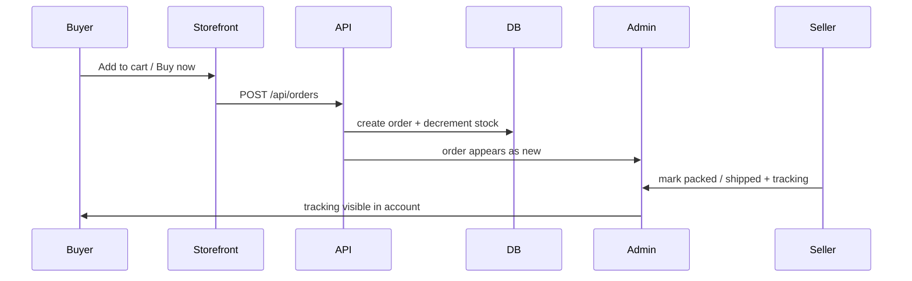

# Don Baraton — Plan marketplace real (Supabase + Admin)

## Objetivo

Pasar de catálogo CSV/local a un marketplace operable:

1. Base de datos propia en Supabase (productos, imágenes, stock, pedidos, envíos)
2. Panel admin completo
3. Flujo de compra real: carrito → pedido → aviso al vendedor → stock → envío

El CSV de Higlou/eBay sigue siendo el onboarding rápido; Supabase es la fuente de verdad a medio plazo.

---

## Principios

| Principio | Detalle |
|-----------|---------|
| Same CSV dual-use | Category ID → departamento de tienda (Bedding, Lighting…) |
| Local → cloud | Hoy `data/*.json`; migrar a Supabase sin romper UI |
| Stock is truth | Toda venta descuenta `quantity`; no vender sin stock |
| Admin first | El vendedor ve pedidos, stock y envíos en un solo panel |

---

## Fases

### Fase 0 — Ahora (esta entrega)
- Galería de fotos usable (flechas, thumbs, swipe)
- Store local de **orders** + admin pedidos/inventario
- Checkout básico que crea pedido y baja stock
- Migración SQL lista para Supabase (schema completo)

### Fase 1 — Supabase propia de Don Baraton ✅ (código listo)

Tablas:

- `db_products` — catálogo (slug, price, qty, category, leaf, ebay_category_id…)
- `db_product_images` — urls + sort_order + storage_path
- Storage bucket `don-baraton-images`

**Setup**

1. Ejecutar `supabase/migrations/20260715_db_products.sql` en el SQL Editor de Supabase
2. Copiar `NEXT_PUBLIC_SUPABASE_URL`, `NEXT_PUBLIC_SUPABASE_ANON_KEY`, `SUPABASE_SERVICE_ROLE_KEY` a `don-baraton/.env.local` (ver `.env.example`)
3. Reiniciar Don Baraton (`npm run dev` en puerto 3001)
4. Admin → **Migrar JSON local → Supabase**
5. Nuevos CSV imports / Publish van directo a Supabase

RLS: público lee active products; service role escribe desde admin.

### Fase 2 — Admin completo
- Dashboard: ventas hoy, stock bajo, pedidos pendientes
- Productos: CRUD, fotos, stock, precio, categorías
- Import CSV → upsert Supabase (reemplaza JSON)
- Pedidos: lista, detalle, marcar pagado / empaquetar / enviado
- Envíos: tracking + notificaciones (email después)
- Inventario: ajustes manuales + historial

### Fase 3 — Checkout / pagos
- Stripe Checkout o PayPal
- Webhook → `order.status = paid` + lock stock
- Emails: comprador (recibo) + vendedor (nuevo pedido)

### Fase 4 — Operaciones
- Etiquetas de envío (Shippo / EasyPost) opcional
- Reembolsos / cancelaciones
- Reportes CSV de ventas

---

## Flujo compra (target)

---

## Decisiones técnicas

1. **Una app Don Baraton** con su propio proyecto Supabase (o schema `don_baraton` en el de Higlou). Recomendado: **mismo proyecto Supabase**, schema/tablas `db_*` para no fragmentar auth.
2. Imágenes: Storage bucket dedicado; CSV sigue aceptando URLs https de Higlou.
3. Mientras no haya pagos: pedidos `pending_payment` o `cod` (pago al confirmar) para operar stock ya.

---

## Criterio de éxito

- [x] Fotos laterales navegables en todo producto multi-imagen
- [x] Al comprarse un ítem, baja stock y aparece en Admin → Pedidos
- [x] Productos e imágenes viven en Supabase (código + migración; activar con env + SQL)
- [x] CSV Higlou sigue importando limpio al admin
